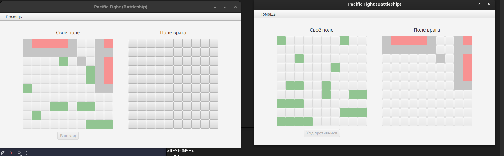
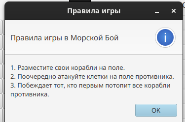
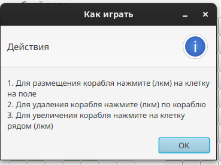

Для запуска из исходных клиента:
```bash 
mvn javafx:run 
```

Для запуска из исходных сервера (его остановка -> teminate (ctr-c)):
```bash
mvn javafx:run -P server
```

Всё механики морского боя реализованы. Клиент - Серверное взаимодействие с помощью сокетов. Даже чекстайл добавил

(Хочу заметить требования создать идеальную архитектуру и отловить все возможные ошибки нет :) )